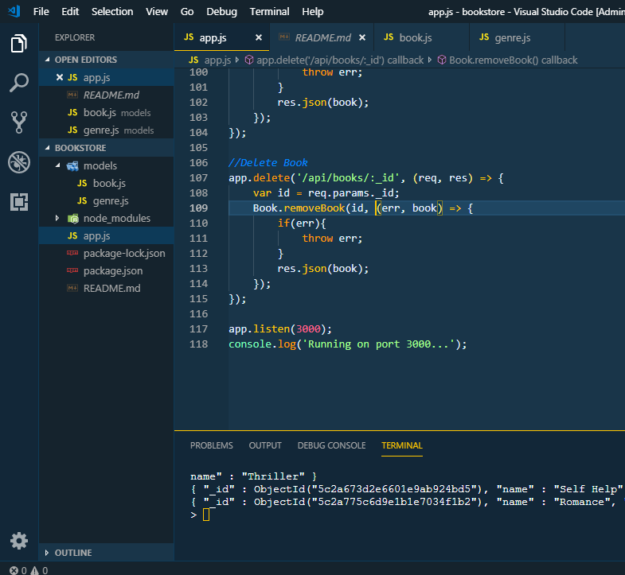

# Bookstore

RESTful API do zero usando NodeJS, Express e MongoDB

Feito a partir do __[tutorial](https://www.youtube.com/watch?v=eB9Fq9I5ocs&list=PLillGF-RfqbYLBAkywyB2cCy8y87GAket)__
e do __[repositorio](https://www.youtube.com/redirect?v=eB9Fq9I5ocs&event=video_description&q=https%3A%2F%2Fgithub.com%2Fbradtraversy%2Fbookstore&redir_token=-UVadR1bqissrZdQGcaq-8Swln58MTU0NjM2NTc3MUAxNTQ2Mjc5Mzcx)__